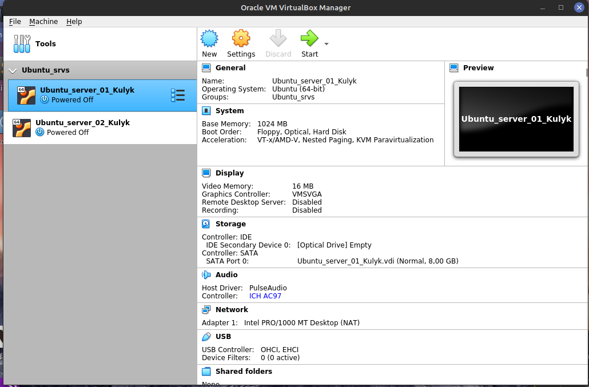
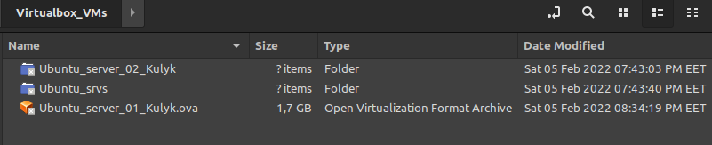
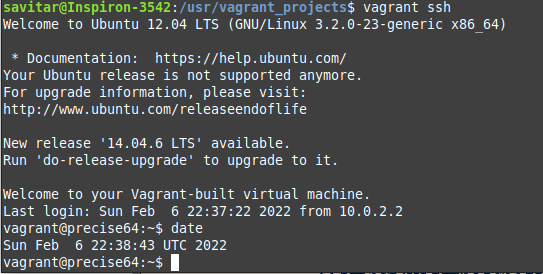
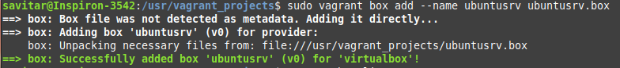

## The most popular hypervisors for infrastructure virtualization

1. VMware vSphere / ESXi
2. Microsoft Hyper-V
3. Citrix XenServer
4. KVM (Kernel-Based Virtual Machine)
5. Red Hat Enterprise Virtualization (RHEV)

## The main differences of the most popular hypervisors

There are two types of hypervisors: Type 1 and Type 2. Type 1 Hypervisor runs directly on the host’s hardware while Type 2 Hypervisor runs on an operating system similar to other computer programs. Hypervisors use different methods to communicate with the host’s physical hardware. Therefore, hypervisors differ from each other in performance, security, cost, suitability for enterprise or personal deployment, functionality and scalability.

## Table of VirtualBox possible connections

| Network modes | VM <=> Host | VM1 <=> VM2 | VM => Internet | VM <= Internet  |
|---------------|-------------|-------------|----------------|-----------------|
| NAT           |       -     |       -     |       +        | Port Forwarding |
| NAT Network   |       -     |       +     |       +        | Port Forwarding |
| Bridged       |       +     |       +     |       +        |        +        |
| Internal      |       -     |       +     |       -        |        -        |
| Host-only     |       +     |       +     |       -        |        -        |

## Screenshots of Task 2.1

